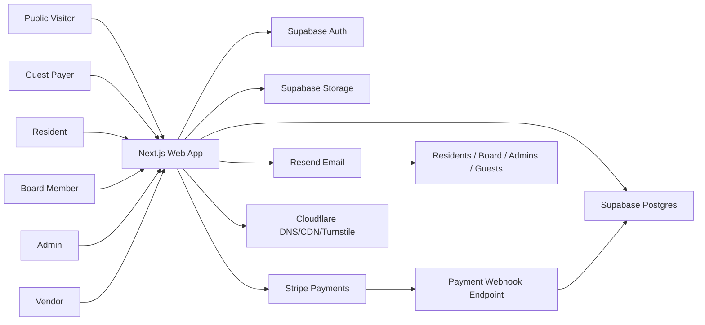

# Spring Meadow Community System Architecture

## 1. Architecture Summary

Spring Meadow Community is a property-centered HOA website and operations portal. The architecture must support public website content, resident self-service, online dues payments, private documents, board/admin workflows, compliance calendar reminders, audit logs, and later expansion into vendors, pool maintenance, and multi-HOA SaaS.

Recommended production architecture:

- **Application:** Next.js + TypeScript
- **UI:** Tailwind CSS and a reusable component library
- **Database:** Supabase Postgres
- **Authentication:** Supabase Auth
- **Authorization:** application-level role checks plus Supabase Row Level Security where appropriate
- **File Storage:** Supabase Storage for MVP; Cloudflare R2 later if storage scale requires it
- **Payments:** Stripe Checkout or Stripe Payment Element
- **Email:** Resend
- **DNS/CDN/Bot Protection:** Cloudflare
- **Hosting:** Vercel + Supabase for fastest first production deployment; Cloudflare Pages/Workers + Supabase is an alternate lower-cost path
- **Monitoring:** application logs, error tracking, payment webhook monitoring, email delivery monitoring, and audit-log review

The system should begin as a single-community deployment for Spring Meadow Community but should avoid architectural decisions that prevent future multi-HOA support.

## 2. Architectural Principles

### 2.1 Property-Centered Design

The property is the durable business record. Users, payments, documents, messages, assessments, and compliance workflows should attach to properties where appropriate.

Design implication:

- Do not model the resident account as the sole source of truth.
- Use a `property_memberships` relationship between users and properties.
- Allow users to hold multiple roles and belong to multiple properties.

### 2.2 Explicit Authorization

The system handles private property records, financial records, board records, legal-sensitive workflows, and documents. Authorization must be explicit and testable.

Design implication:

- Every private query must be scoped by current user, community, role, and property authorization.
- Document access must be mediated through permission checks and signed URLs or equivalent private storage access.
- Guest payment flows must be isolated from authenticated resident account flows.

### 2.3 Legal-Sensitive Workflow Guardrails

The product should warn, document, and route legal-sensitive workflows for review. It must not automatically file liens, foreclose, impose legal action, or act as legal counsel.

Design implication:

- Use workflow statuses and legal-review gates.
- Preserve evidence of dates, notices, recipients, decisions, and approvals.
- Make statutory defaults configurable by community.

### 2.4 Low-Ops Managed Services

The first production version should minimize server administration.

Design implication:

- Prefer Supabase-managed Postgres/Auth/Storage.
- Prefer Stripe-hosted payment flows.
- Prefer Vercel or Cloudflare managed hosting.
- Avoid self-hosted payment or auth infrastructure.

### 2.5 Future Multi-HOA Readiness

The first release may serve one HOA, but data and configuration should be community-scoped.

Design implication:

- Add `community_id` to all core business tables.
- Store community settings for branding, dues rules, compliance defaults, document categories, payment fee policy, and feature flags.
- Avoid hardcoding Spring Meadow Community values outside seed/configuration data.

## 3. System Context



## 4. Application Architecture

### 4.1 Next.js Application

Use a single Next.js application with route groups for public, resident, board/admin, and API/webhook surfaces.

Recommended route groups:

- Public site routes
- Auth routes
- Resident portal routes
- Board/admin portal routes
- Guest payment routes
- API routes/server actions
- Stripe webhook route

Suggested structure:

```text
app/
  (public)/
  (auth)/
  (resident)/
  (admin)/
  (guest-payment)/
  api/
    stripe/
      webhook/
components/
lib/
  auth/
  authorization/
  payments/
  documents/
  compliance/
  email/
  audit/
server/
  actions/
  queries/
  services/
```

### 4.2 Server-Side Business Logic

Business workflows should be implemented server-side using Next.js server actions, route handlers, or service functions.

Server-side domains:

- Auth/session helpers
- Authorization checks
- Property membership lookup
- Payment session creation
- Stripe webhook processing
- Document upload/access control
- Compliance deadline calculation
- Warning email scheduling
- Audit log writing

### 4.3 Client-Side UI

Client components should be used for interactive UI only. Sensitive decisions must stay server-side.

Examples:

- Resident dashboard widgets
- Payment form launch button
- Calendar views
- Admin table filtering
- Document upload UI
- Message composer

## 5. Data Architecture

The detailed data model belongs in:

`/home/smount/Websites/SpringMeadowCommunity/docs/bmad/phase-3-design/data-model.md`

High-level core entities:

- Community
- Property
- User profile
- Property membership
- Role/permission
- Assessment cycle
- Assessment
- Payment
- Document
- Announcement
- Event
- Message/thread
- Compliance calendar event
- Compliance task
- Records request
- Meeting
- Meeting notice
- Meeting minutes
- Annual financial statement
- Audit/review workflow
- Delinquency case
- Lien case
- Fine/suspension case
- Vendor
- Vendor proposal
- Vendor invoice
- Amenity
- Pool maintenance log
- Audit log
- Email log

### 5.1 Community Scope

Most tables must include `community_id` even in the first single-HOA deployment.

Reason:

- Enables future multi-HOA support.
- Prevents later invasive migration.
- Allows community-level settings.

### 5.2 Property Membership

Use a join table to connect users to properties.

Required behaviors:

- Multiple users can access one property.
- One user can access multiple properties.
- Membership can have status: invited, active, suspended, removed.
- Membership can have relationship type: owner, co-owner, resident, manager, renter, other.

### 5.3 Audit Logging

Create append-only audit records for sensitive actions.

Audit log should capture:

- Actor user ID
- Community ID
- Target table/entity
- Target record ID
- Action
- Timestamp
- Previous values when appropriate
- New values when appropriate
- Request/IP/session metadata when appropriate

Sensitive actions:

- Payment changes
- Manual adjustments
- Document visibility changes
- Role changes
- Property membership changes
- Compliance workflow completion
- Lien/fine/suspension status changes
- Vendor payment detail changes later

## 6. Authentication Architecture

Use Supabase Auth for identity.

Authentication requirements:

- Email/password or magic link can be supported.
- Session must be checked server-side for private routes.
- Public visitors and guest payers do not require resident accounts.
- Guest payment flow must create payment records without exposing private account data.

User profile data should live in an application table, not only Supabase Auth metadata.

Recommended tables:

- `auth.users` managed by Supabase
- `profiles` managed by application
- `property_memberships`
- `user_roles`

## 7. Authorization Architecture

Authorization should use layered checks:

1. Authenticated user check
2. Community scope check
3. Role check
4. Property membership check
5. Document visibility or workflow-specific permission check

### 7.1 Public Access

Public visitors may read only public content:

- Public pages
- Public announcements
- Public events
- Public documents
- Public vendor proposal form when implemented

### 7.2 Guest Payment Access

Guest payment flow must:

- Accept address and/or account number.
- Avoid disclosing balance or owner names.
- Create Stripe payment session for payer-entered amount or configured payment amount.
- Store receipt and transaction metadata.
- Attach successful payment to property after webhook confirmation.

Guest payment flow must not:

- Show full property profile.
- Show dues balance.
- Show documents.
- Show owner or resident identity.
- Show payment history.

### 7.3 Resident Access

Residents may access:

- Properties linked through active memberships.
- Dues status for linked property.
- Payment history for linked property.
- Resident-visible and property-specific documents.
- Resident announcements/events.
- Their own resident-to-board messages.

### 7.4 Board/Admin Access

Board/admin permissions should be granular.

Minimum permission groups:

- Manage users/properties
- Manage payments/assessments
- Manage documents
- Manage announcements/events
- Manage compliance calendar
- View audit logs
- Manage legal-sensitive workflows
- Configure community settings

### 7.5 Supabase RLS

Use Supabase Row Level Security where it strengthens direct data access boundaries. Keep critical authorization checks in server-side services as well so implementation is clear and testable.

Recommended approach:

- RLS enabled on core tables.
- Policies scoped by `community_id`, roles, and property memberships.
- Server-side admin operations use service role only inside trusted server code.
- Never expose service role keys to the client.

## 8. Payments Architecture

Use Stripe for payment processing.

### 8.1 Payment Flow

Resident payment flow:

1. Resident opens dashboard.
2. System fetches authorized property dues status.
3. Resident chooses pay dues.
4. Server creates Stripe Checkout session or Payment Intent.
5. Resident completes payment in Stripe-hosted or Stripe-controlled UI.
6. Stripe sends webhook.
7. Webhook verifies signature.
8. Server records payment success/failure.
9. Resident sees updated payment history.

Guest payment flow:

1. Guest enters property address and/or account number.
2. System verifies property exists without disclosing private data.
3. Guest enters payer details and payment amount.
4. Server creates Stripe session.
5. Guest pays through Stripe.
6. Stripe webhook records payment against property.
7. Guest receives receipt only.

### 8.2 Payment Records

Store:

- Community ID
- Property ID
- User ID when authenticated
- Guest payer email/name when provided
- Stripe customer/session/payment intent IDs
- Amount
- Fee policy
- Status
- Payment method summary
- Receipt URL/reference
- Timestamps

### 8.3 Webhook Reliability

Payment webhook handler must:

- Verify Stripe signature.
- Be idempotent.
- Store event IDs to prevent duplicate processing.
- Log failures.
- Avoid trusting client-side success as final.

## 9. Document Architecture

MVP: Supabase Storage.

Future scale option: Cloudflare R2.

### 9.1 Document Access

Documents should be private by default unless explicitly public.

Access pattern:

1. User requests document.
2. Server verifies user access.
3. Server creates short-lived signed URL or streams file.
4. Audit log records sensitive access if required.

### 9.2 Document Metadata

Store document metadata in Postgres:

- Community ID
- Storage object path
- Title
- Category
- Visibility level
- Related property/vendor/meeting/workflow IDs
- Effective date
- Expiration date
- Uploaded by
- Created/updated timestamps

## 10. Compliance Calendar Architecture

Compliance calendar should be modeled as configurable rules plus generated events/tasks.

### 10.1 Compliance Rules

Examples:

- Annual association meeting required once per year.
- Meeting notice window: earliest 60 days before, latest 10 days before.
- Annual financial statement deadline: fiscal year close plus 75 days.
- Unpaid assessment statement due: 10 business days after request.
- Lien readiness: 30 days unpaid.
- Pre-lien waiting period: 15 days after statement mailing.
- Lien enforcement reminder: three years after filing.

Rules must be community-configurable.

### 10.2 Calendar Event Generation

Use background jobs or scheduled functions to:

- Generate upcoming compliance events.
- Calculate due dates.
- Send warning emails.
- Escalate overdue items.
- Mark reminders sent in email logs.

### 10.3 Warning Emails

Email architecture:

- Store email rules.
- Queue/send through Resend.
- Store email delivery records.
- Prevent duplicate reminder sends.
- Allow recipient groups by workflow type.

Recipient groups:

- Secretary/admin for meetings and records.
- Treasurer/president/admin for financial deadlines.
- President/treasurer/secretary/admin/legal reviewer for lien/fine/suspension workflows.
- Residents only for resident-facing dues or notices.
- Guest payers only receive receipts.

## 11. Messaging Architecture

Resident-to-board communication should be stored as messages or threads.

Requirements:

- Message belongs to community, property, sender, and category.
- Board/admin can reply.
- User sees their own property messages.
- Board/admin can filter by status/category/property.
- Messages are retained according to settings.

Recommended statuses:

- Open
- Pending board response
- Pending resident response
- Closed
- Archived

## 12. Email Architecture

Use Resend for transactional email.

Email categories:

- Payment receipts
- Guest payment receipts
- Compliance reminders
- Records request warnings
- Meeting notice workflow reminders
- Resident communication notifications
- Admin invitations

Email sending must:

- Be server-side.
- Log send attempts.
- Track delivery status where available.
- Avoid exposing private data in email bodies unless intended.

## 13. Background Jobs and Scheduling

Needed scheduled work:

- Compliance reminder generation.
- Overdue reminder escalation.
- Annual financial statement deadline reminders.
- Meeting notice deadline reminders.
- Records request deadline reminders.
- Payment status reconciliation checks.
- Email retry handling.

Implementation options:

- Supabase Edge Functions with scheduled triggers.
- Vercel Cron Jobs if hosted on Vercel.
- External scheduler calling secured API endpoints.

Recommendation:

- If using Vercel, use Vercel Cron Jobs for scheduled reminders.
- Keep scheduled job logic idempotent.
- Store job run logs.

## 14. Hosting and Deployment Architecture

### 14.1 Recommended MVP Deployment

Use:

- Vercel for Next.js hosting.
- Supabase Pro for database/auth/storage.
- Stripe for payment processing.
- Resend for email.
- Cloudflare for DNS, CDN, Turnstile, and basic protection.

### 14.2 Environment Separation

Use at least:

- Local development
- Preview/staging
- Production

Each environment should have separate:

- Supabase project or schemas where feasible.
- Stripe test/live keys.
- Resend configuration.
- Environment variables.

### 14.3 Secrets Management

Secrets must live in hosting provider environment variables or managed secret storage.

Never commit:

- Supabase service role key
- Stripe secret key
- Stripe webhook secret
- Resend API key
- Database password

## 15. Observability

Minimum observability:

- Application error logs.
- Stripe webhook processing logs.
- Email send logs.
- Compliance job run logs.
- Audit logs for business-sensitive actions.

Recommended:

- Add Sentry or equivalent for application exceptions.
- Add admin dashboard for failed emails, failed webhooks, and overdue jobs.

## 16. Security Architecture

### 16.1 Controls

- Server-side auth checks for private routes.
- Role-based access control.
- Property-level access checks.
- RLS on core Supabase tables.
- Private document storage.
- Signed URLs for file access.
- Stripe webhook signature verification.
- CSRF-safe mutation patterns.
- Bot protection on public forms and guest payment.
- Rate limiting for sensitive endpoints.
- Audit logs for sensitive actions.

### 16.2 Financial Safety

MVP must audit financial actions.

Later phases should add:

- Two-person approval.
- Vendor payment detail change approval.
- Refund approval.
- Reserve transfer approval.
- Monthly reconciliation.
- Audit/review export package.

### 16.3 Legal-Sensitive Safety

Workflows involving fines, suspension, liens, foreclosure-related tracking, and attorney-fee collection must:

- Require legal/compliance review.
- Store evidence.
- Track deadlines.
- Avoid automatic external filing/action.

## 17. Data Retention and Privacy

Retention policies should be configurable.

Data categories:

- Payment records
- Documents
- Meeting records
- Messages
- Compliance workflow evidence
- Audit logs
- Vendor records
- Pool maintenance records later

Privacy rules:

- Guest payers receive receipt only.
- Residents access only linked property records.
- Board/admin access is permission-controlled.
- Public pages expose only public content.

## 18. API Architecture

Detailed API design belongs in:

`/home/smount/Websites/SpringMeadowCommunity/docs/bmad/phase-3-design/api.md`

Recommended API style:

- Use server actions for authenticated app mutations where practical.
- Use route handlers for webhooks, public forms, file access, and integrations.
- Keep services organized by domain.

API surfaces:

- Auth/profile helper endpoints if needed.
- Property/member management.
- Payments.
- Stripe webhook.
- Documents.
- Announcements.
- Events.
- Messages.
- Compliance calendar.
- Records requests.
- Admin configuration.

## 19. Frontend Information Architecture

### 19.1 Public Navigation

- Home
- About/Community Info
- Announcements
- Events
- Documents/Public Resources
- Contact
- Pay Dues
- Login

### 19.2 Resident Navigation

- Dashboard
- Payments
- Documents
- Announcements
- Events
- Contact Board
- My Property

### 19.3 Board/Admin Navigation

- Dashboard
- Properties
- Users
- Payments
- Assessments
- Documents
- Announcements
- Events
- Messages
- Compliance Calendar
- Records Requests
- Audit Logs
- Settings

Later:

- Vendors
- Maintenance
- Architectural Requests
- Pool Maintenance
- Legal Workflows

## 20. Major Architecture Decisions

### ADR-001: Use Next.js and TypeScript

Decision: Use Next.js with TypeScript for the application.

Rationale:

- Strong fit for public site plus authenticated portal.
- Supports server-side rendering and server-side business logic.
- Works well with Vercel and modern React patterns.

### ADR-002: Use Supabase for Postgres, Auth, and MVP Storage

Decision: Use Supabase for managed Postgres, authentication, and MVP document storage.

Rationale:

- Reduces operational burden.
- PostgreSQL fits relational HOA domain data.
- Supabase Auth and RLS support secure access patterns.

### ADR-003: Use Stripe for Payments

Decision: Use Stripe Checkout or Payment Element for dues payments.

Rationale:

- Avoids direct card storage.
- Supports card and ACH payment options.
- Provides webhooks and receipts.

### ADR-004: Use Resend for Email

Decision: Use Resend for transactional and warning emails.

Rationale:

- Simple API.
- Good fit for receipts, invitations, and compliance reminders.

### ADR-005: Use Cloudflare for DNS, CDN, and Bot Protection

Decision: Use Cloudflare for DNS/CDN and Turnstile.

Rationale:

- Low cost.
- Protects public forms and guest payment flows.
- Supports future storage option through R2.

### ADR-006: Scope All Core Records by Community

Decision: Include `community_id` on core records from the beginning.

Rationale:

- Supports future multi-HOA product.
- Prevents expensive refactor later.
- Keeps authorization rules explicit.

### ADR-007: Do Not Automate Legal Actions

Decision: Legal-sensitive workflows provide checklists, reminders, records, and review gates only.

Rationale:

- Reduces legal risk.
- Preserves human board/legal decision-making.
- Aligns with product guardrails.

## 21. Risks and Mitigations

### Risk: Authorization Bugs Expose Private Records

Mitigation:

- Centralize authorization helpers.
- Use RLS where appropriate.
- Write tests for property membership, guest payment, document visibility, and board/admin access.

### Risk: Payment Webhook Failures Cause Bad Balances

Mitigation:

- Verify Stripe webhook signatures.
- Make webhook processing idempotent.
- Store raw event IDs.
- Add failed webhook monitoring.

### Risk: Compliance Reminders Are Treated as Legal Advice

Mitigation:

- Display legal note.
- Make rules configurable.
- Require review gates.
- Avoid automatic legal action.

### Risk: Multi-HOA Architecture Adds Too Much MVP Complexity

Mitigation:

- Scope data by community now.
- Build only one community's UI/config initially.
- Add self-service onboarding later.

### Risk: Document Storage Costs Grow With Photos and Scans

Mitigation:

- Start with Supabase Storage.
- Track storage usage.
- Move to Cloudflare R2 later if needed.

## 22. Architecture Handoff Requirements

The next design documents should be created at:

- API: `/home/smount/Websites/SpringMeadowCommunity/docs/bmad/phase-3-design/api.md`
- Data model: `/home/smount/Websites/SpringMeadowCommunity/docs/bmad/phase-3-design/data-model.md`

The task breakdown should be created at:

- Tasks: `/home/smount/Websites/SpringMeadowCommunity/docs/bmad/phase-4-tasks/tasks.md`

The data model must define all MVP entities, keys, relationships, status enums, and authorization-relevant fields.

The API design must define endpoints/server actions for public, resident, board/admin, guest payment, Stripe webhook, documents, messages, and compliance calendar workflows.
